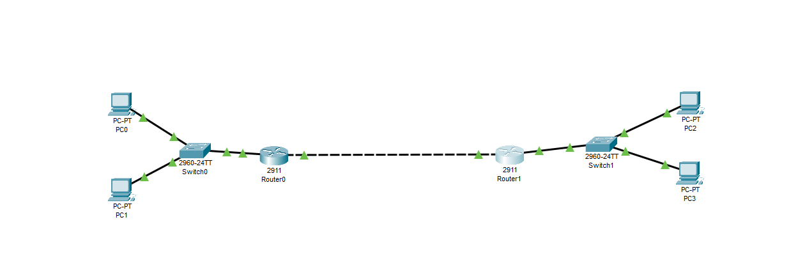

# Lab 01 – Basic Small Office Network with Static Routing

## 🧠 Objective:
Simulate a small office setup with two routers and four PCs. Demonstrate static routing across two separate networks using Cisco Packet Tracer.

## 🛠️ Topology:
- 2 Routers (2911)
- 2 Switches
- 4 PCs (2 on each router)
- Router-to-Router connection

## 📋 IP Addressing Scheme:

| Device  | Interface    | IP Address     | Subnet Mask       |
|---------|--------------|----------------|-------------------|
| PC1     | FastEthernet0| 192.168.1.10   | 255.255.255.0     |
| PC2     | FastEthernet0| 192.168.1.11   | 255.255.255.0     |
| PC3     | FastEthernet0| 192.168.2.10   | 255.255.255.0     |
| PC4     | FastEthernet0| 192.168.2.11   | 255.255.255.0     |
| Router1 | Gig0/0       | 192.168.1.1    | 255.255.255.0     |
| Router1 | Gig0/1       | 10.0.0.1       | 255.255.255.0     |
| Router2 | Gig0/0       | 192.168.2.1    | 255.255.255.0     |
| Router2 | Gig0/1       | 10.0.0.2       | 255.255.255.0     |

## 🧪 What I Did:
- Connected all PCs and routers using switches
- Assigned IP addresses to all interfaces
- Configured `no shutdown` on router interfaces
- Verified that all connections turned green

## ✅ Next Step:
Configure static routes to enable communication between departments.

**Status:** ✅ Network physically connected and functional  
